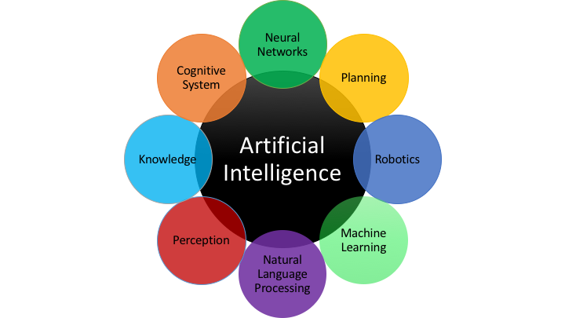

<!----- Conversion time: 0.954 seconds.

Using this Markdown file:

1. Cut and paste this output into your source file.
2. See the notes and action items below regarding this conversion run.
3. Check the rendered output (headings, lists, code blocks, tables) for proper
   formatting and use a linkchecker before you publish this page.

Conversion notes:

* Docs to Markdown version 1.0β17
* Tue Aug 27 2019 12:20:47 GMT-0700 (PDT)
* Source doc: https://docs.google.com/open?id=1i-EsNOdY1eFx5lveG_N8j4WhGXphkBqMAk07LcHMj0w
* This is a partial selection. Check to make sure intra-doc links work.
* This document has images: check for >>>>>  gd2md-html alert:  inline image link in generated source and store images to your server.
----->

**Lesson 1: What is AI?**

Artificial Intelligence or AI as it is commonly referred to is quickly revolutionizing almost every industry and the way business and transactions are completed more than any other inception since machinery and interchangeable parts ushered in the Industrial Revolution. To quote Professor Nick Bostrom:

>“Let an ultraintelligent machine be defined as a machine that can far surpass all the intellectual activities of any man however clever. Since the design of machines is one of these intellectual activities, an ultraintelligent machine could design even better machines; there would then unquestionably be an “intelligence explosion,” and the intelligence of man would be left far behind. Thus the first ultraintelligent machine is the last invention that man need ever make, provided that the machine is docile enough to tell us how to keep it under control.” ― _Nick Bostrom, Superintelligence: Paths, Dangers, Strategies_

Yes, AI does often portray images of Hollywood doom and gloom, but >it also represents a chance for society to better understand problems like never before and this already is and will continue to lead new discoveries in areas like Health and Medicine or even Environmental Sciences and Engineering. Beginning with a single area like machine Learning, we are already beginning to see developments in many areas like never before. Just look at all of the specific areas AI involves in Fig 1 below and think about the many different industries that might be impacted that haven't been as of yet. We’re just starting to see what will be the future of almost everything we know. How will we change to take advantage of this new era? 

Fig 1. Areas within AI

[Home](tif100.md) | [Next Page](page2.md)

<!-- Docs to Markdown version 1.0β17 -->
