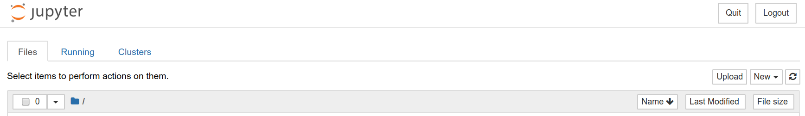
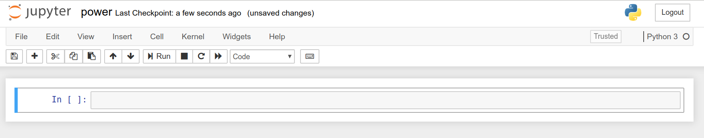

<!----- Conversion time: 1.493 seconds.


Using this Markdown file:

1. Cut and paste this output into your source file.
2. See the notes and action items below regarding this conversion run.
3. Check the rendered output (headings, lists, code blocks, tables) for proper
   formatting and use a linkchecker before you publish this page.

Conversion notes:

* Docs to Markdown version 1.0β17
* Tue Aug 27 2019 16:21:32 GMT-0700 (PDT)
* Source doc: https://docs.google.com/open?id=1i-EsNOdY1eFx5lveG_N8j4WhGXphkBqMAk07LcHMj0w
* This is a partial selection. Check to make sure intra-doc links work.
* This document has images: check for >>>>>  gd2md-html alert:  inline image link in generated source and store images to your server.
----->


<p align="center"></p>

Now we can start Jupyter Notebook with the following command entered at the terminal or command prompt::


```
	jupyter notebook
```


This will open a new browser window showing the following:


<p align="center"></p>


Click to new and then Python 3 to create your first notebook. If successful, you should see the following screen in your browser (I named my notebook power:


<p align="center"></p>


Step 5: In order to use the awesome libraries we installed previously we first need to import them into our notebook as follows; they can go into the very first cell:


```
    import pandas as pd
    import matplotlib.pyplot as plt
    import seaborn as sns
```


Step 6: Now we’re ready to import our data. Hopefully, you've already saved it in the same folder you're working in. If not, find the file and place it in this same working folder. After doing so, we can easily use pandas’ read_csv function to import the data into a dataframe as follows:

```
	power = pd.read_csv("household_power_consumption.csv")
```

---

[Home](tif100.md) | [Next Page](page11.md)

<!-- Docs to Markdown version 1.0β17 -->
