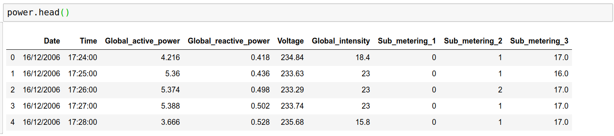

<!----- Conversion time: 1.205 seconds.


Using this Markdown file:

1. Cut and paste this output into your source file.
2. See the notes and action items below regarding this conversion run.
3. Check the rendered output (headings, lists, code blocks, tables) for proper
   formatting and use a linkchecker before you publish this page.

Conversion notes:

* Docs to Markdown version 1.0β17
* Tue Aug 27 2019 17:07:17 GMT-0700 (PDT)
* Source doc: https://docs.google.com/open?id=1i-EsNOdY1eFx5lveG_N8j4WhGXphkBqMAk07LcHMj0w
* This is a partial selection. Check to make sure intra-doc links work.
* This document has images: check for >>>>>  gd2md-html alert:  inline image link in generated source and store images to your server.
----->


<p align="center"></p>


Student X, I want you to stop and notice a few things here:


1. Notice that I assigned a variable names ‘power’ to the dataset we’re importing with pandas?
2. Most of the work we’ll do in Pandas is stored in a data structure or container called a dataframe, which is a simple two-dimensional data structure where data is aligned in rows and columns like you have likely seen in Excel or other spreadsheets. We’ll dive into this a bit more later.
3. We’re working with a CSV file in this problem, which is basically a simple text file with the important content separated by commas - hence the Comma Separated Value name. Getting data into a development environment will not always be this easy, as you’ll soon see, but we’re working on the business problem right now. 

A quick preview of the data with the .head method will provide a quick idea of what each column in the dataset contains:
```
	power.head()
```

<p align="center"></p>


**When to choose What?**

In order to make the right choice of what variables to keep and which will remain, we have to study the data to gain more insight. There are numerous ways to accomplish this, but we’ll start with the first basic two methods: correlation and Descriptive Statistics.

_Correlation_

Correlation the extent to which two or more variables work together. A positive correlation indicates the extent to which those variables increase or decrease in parallel; a negative correlation indicates the extent to which one variable increases as the other decreases. More simply explained: when two numbers are highly related they have a high correlation, which can be positive or negative.


A **correlation coefficient** is a way to put a value to the relationship. Correlation coefficients have a value of between -1 and 1. A “0” means there is no relationship between the variables at all, while -1 or 1 means that there is a perfect negative or positive correlation (negative or positive correlation here refers to the type of graph the relationship will produce).

<p align="center"><a href="http://www.youtube.com/watch?feature=player_embedded&v=GtV-VYdNt_g" target="_blank">
</a></p>

[Home](tif100.md) | [Next Page](page12.md)

<!-- Docs to Markdown version 1.0β17 -->


<!-- Docs to Markdown version 1.0β17 -->
