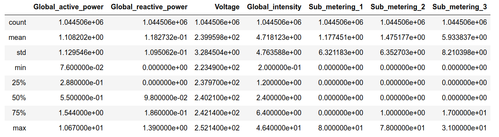

<!----- Conversion time: 0.975 seconds.


Using this Markdown file:

1. Cut and paste this output into your source file.
2. See the notes and action items below regarding this conversion run.
3. Check the rendered output (headings, lists, code blocks, tables) for proper
   formatting and use a linkchecker before you publish this page.

Conversion notes:

* Docs to Markdown version 1.0β17
* Tue Aug 27 2019 17:34:44 GMT-0700 (PDT)
* Source doc: https://docs.google.com/open?id=1i-EsNOdY1eFx5lveG_N8j4WhGXphkBqMAk07LcHMj0w
* This is a partial selection. Check to make sure intra-doc links work.
* This document has images: check for >>>>>  gd2md-html alert:  inline image link in generated source and store images to your server.
----->


<p align="center"></p>


Step 8: Let's have a quick look at the Descriptive Statics of the Power dataset; we’ll use the describe() function in Pandas to help us accomplish this.
```
	power.describe()
```
Provides the following output:


<p align="center"></p>

[Home](tif100.md) | [Next Page](page14.md)


<!-- Docs to Markdown version 1.0β17 -->
