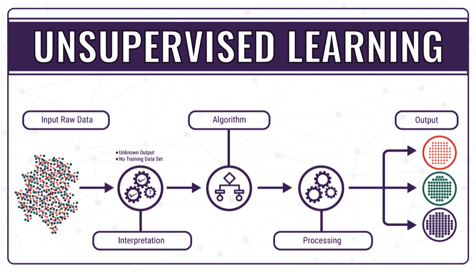

<!----- Conversion time: 1.254 seconds.

Using this Markdown file:

1. Cut and paste this output into your source file.
2. See the notes and action items below regarding this conversion run.
3. Check the rendered output (headings, lists, code blocks, tables) for proper
   formatting and use a linkchecker before you publish this page.

Conversion notes:

* Docs to Markdown version 1.0β17
* Tue Aug 27 2019 15:14:48 GMT-0700 (PDT)
* Source doc: https://docs.google.com/open?id=1i-EsNOdY1eFx5lveG_N8j4WhGXphkBqMAk07LcHMj0w
* This is a partial selection. Check to make sure intra-doc links work.
* This document has images: check for >>>>>  gd2md-html alert:  inline image link in generated source and store images to your server.
----->

_Unsupervised Machine Learning_

Unsupervised machine learning is much different than supervised machine learning because it doesn't need a set of data with related features and related outcomes for any learning to occur.  in most cases where unsupervised machine learning is utilized the learning occurs in the form of identifying specific clusters that groups updated would fall into or be divided into.  

For example: Let's say we have a large bucket of rocks we have collected from the last twenty years of our travels around the world. The bucket is far too large for us to count or even identify each type of rock, but we want to assign each to a group so we can help remember where and when we collected it. We can use _Unsupervised Learning_ to identify similarities between the different types of rocks and, while the individual groups will not have any type of label, per se, the learning will specify the number of groups potentially in the bucket as well as which rock belongs to which group. The process is shown below in Fig 3. 

Fig. 3: Unsupervised Machine Learning. Source: <a href="https://bigdata-madesimple.com/machine-learning-explained-understanding-supervised-unsupervised-and-reinforcement-learning/">Big Data Made Simple</a>

[Home](tif100.md) | [Next Page](page4.md)

<!-- Docs to Markdown version 1.0β17 -->
