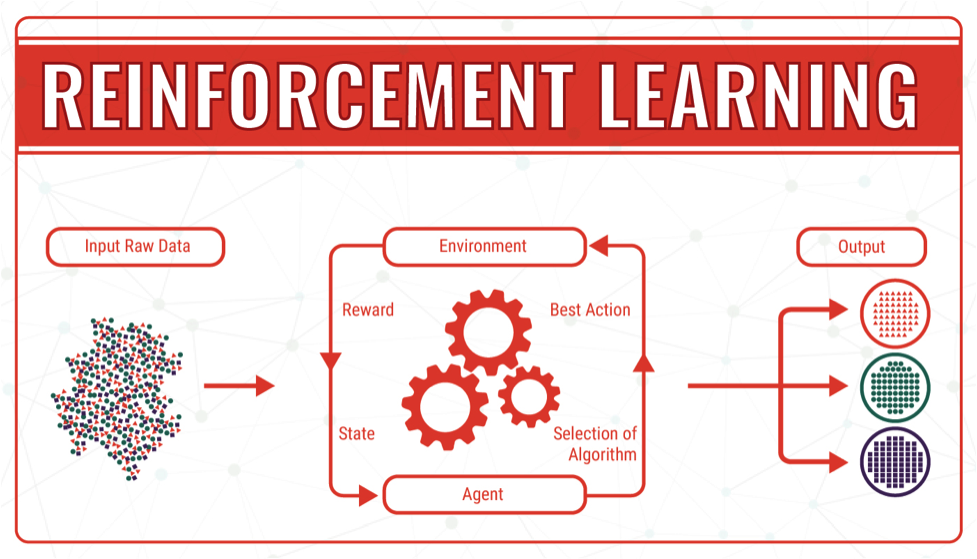

<!----- Conversion time: 1.313 seconds.

Using this Markdown file:

1. Cut and paste this output into your source file.
2. See the notes and action items below regarding this conversion run.
3. Check the rendered output (headings, lists, code blocks, tables) for proper
   formatting and use a linkchecker before you publish this page.

Conversion notes:

* Docs to Markdown version 1.0β17
* Tue Aug 27 2019 15:27:31 GMT-0700 (PDT)
* Source doc: https://docs.google.com/open?id=1i-EsNOdY1eFx5lveG_N8j4WhGXphkBqMAk07LcHMj0w
* This is a partial selection. Check to make sure intra-doc links work.
* This document has images: check for >>>>>  gd2md-html alert:  inline image link in generated source and store images to your server.
----->

_Reinforcement Machine Learning_

Ok, this one is a bit abstract so let me use some analogy to break it down a bit. Let's say I have a problem to solve or better yet, a goal to reach. This goal has parameters and even certain steps you can take to achieve it, but it also has some pitfalls you might fall into along your journey to satisfying the goal. Sounds typical, right? We can actually build a type of Reinforcement algorithm that will make decisions based on reward (the right steps toward the goal) or penalties (falling into the pitfalls); this is accomplished through either exploration or exploitation (trial and error), but eventually, an optimal path to the goal is found.

So why not use these for everything? 

The kicker is the environment in which the goal lives is static and unchanging, unlike life that is often full of twists and turns and unknows. Reinforcement algorithms are excellent for sensor or IoT problems where calibration is important or anywhere the environment can be considered static, which is often the case in many manufacturing scenarios. 

Fig. 4: Reinforcement Machine Learning. Source: <a href="https://bigdata-madesimple.com/machine-learning-explained-understanding-supervised-unsupervised-and-reinforcement-learning/">Big Data Made Simple</a>

[Home](tif100.md) | [Next Page](page5.md)

<!-- Docs to Markdown version 1.0β17 -->
