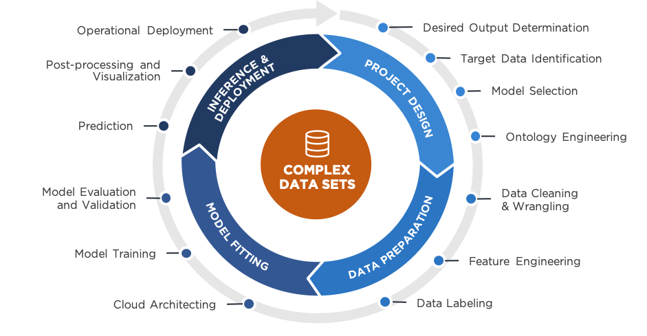

<!----- Conversion time: 1.014 seconds.

Using this Markdown file:

1. Cut and paste this output into your source file.
2. See the notes and action items below regarding this conversion run.
3. Check the rendered output (headings, lists, code blocks, tables) for proper
   formatting and use a linkchecker before you publish this page.

Conversion notes:

* Docs to Markdown version 1.0β17
* Tue Aug 27 2019 15:52:27 GMT-0700 (PDT)
* Source doc: https://docs.google.com/open?id=1i-EsNOdY1eFx5lveG_N8j4WhGXphkBqMAk07LcHMj0w
* This is a partial selection. Check to make sure intra-doc links work.
* This document has images: check for >>>>>  gd2md-html alert:  inline image link in generated source and store images to your server.
----->

**Lesson 2: Understanding the Problem:**

Student X, the most integral part of any Artificial Intelligence process is understanding the problem we are to solve before we get started designing any of the implementations of the solution. This is centred on obtaining as much knowledge as one can about the data whether through asking an expert and acquiring domain knowledge or, in its absence, using Statistical methods and tools to assist one in doing the same. In this lesson we’re going to visit a mock scenario we present to all of our apprentices. The goal of this exercise is for you and me to work together to identify potential aspects of a dataset that we might need to extract for a project and which aspects, if any, we can leave behind. This will help us better understand the nature of the business problem being asked while also learning some new tools that will assist us in making decisions. 

Fig. 5: Machine Learning Process. Source: <a href="https://www.ntconcepts.com/introduction-to-the-machine-learning-lifecycle-hidden-challenges-blog-series/">NT Concepts</a>

[Home](tif100.md) | [Next Page](page7.md)

<!-- Docs to Markdown version 1.0β17 -->
