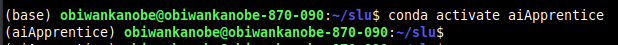

<!----- Conversion time: 0.933 seconds.


Using this Markdown file:

1. Cut and paste this output into your source file.
2. See the notes and action items below regarding this conversion run.
3. Check the rendered output (headings, lists, code blocks, tables) for proper
   formatting and use a linkchecker before you publish this page.

Conversion notes:

* Docs to Markdown version 1.0β17
* Tue Aug 27 2019 16:04:54 GMT-0700 (PDT)
* Source doc: https://docs.google.com/open?id=1i-EsNOdY1eFx5lveG_N8j4WhGXphkBqMAk07LcHMj0w
* This is a partial selection. Check to make sure intra-doc links work.
* This document has images: check for >>>>>  gd2md-html alert:  inline image link in generated source and store images to your server.
----->


<p align="center"></p>

**Step 1: Begin by creating your first Conda virtual environment on your local machine in a folder of your choosing as follows:**


```
conda create --name aiApprentice python=3.6
```

---
Virtual Environments: A virtual environment is a tool that helps to keep dependencies required by different projects separate by creating isolated spaces for them that contain per-project dependencies.

---

**Step 2: Activate the new virtual environment as follows:**


```
conda activate aiApprentice
```

---
Notice the name of your terminal (or Command Prompt) change? This indicates you are now working within the new virtual environment.

<p align="center"></p>
---

Great work - now let's install the rest of the packages in the new environment

**Step 3: To install the remainder of the needed libraries we just need to specify their names, separated by spaces, along with the conda prompt as follows:**


```
conda install pandas matplotlib seaborn jupyter
```


This will install the remainder of the libraries needed for this exercise. You can verify the libraries have been installed by typing the following:


```
conda list
```


---
Don't be alarmed if there are more packages than you specified already installed. Remember: the Conda environment starts by installing a few of the base packages it needs when you first create it.

---

**Step 4: We, along with many other data related departments, use notebooks for most of our analysis so we can easily share the details and reproducible work with one another. Let's get you started on creating your first, but be sure to save it and always create a backup.**

---
Did you know many developers use GitHub repos as backup areas for their work?

---

[Home](tif100.md) | [Next Page](page10.md)

<!-- Docs to Markdown version 1.0β17 -->
